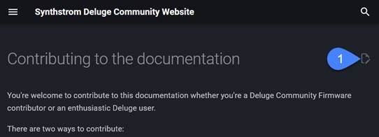

# Contributing to the documentation

You're welcome to contribute to this documentation whether you're a Deluge Community Firmware contributor or an enthusiastic Deluge user.

There are two ways to contribute:

* Using the GitHub website, for casual contributors
* Using a local development environment, for major contributors

## Resources

If you want to talk with other Deluge documentation contributors, join the [Deluge Community Discord](https://discord.gg/SK8efrna) and look for the [Deluge Documentation Initiative](https://discord.com/channels/608916579421257728/1292168517432381480) channel.

[:fontawesome-brands-discord: Join the Deluge Community Discord](https://discord.gg/SK8efrn){ .md-button .md-button--primary }

## Requirements

To make changes to the site, you need a [GitHub account](https://github.com/signup).

## For casual contributors

If you want to work on individual pages, refine existing content, correct a typo, or similar, you can do so through the GitHub website.

You need a GitHub account and permission to work on the project, but no other setup or tools are required.

1. On the community documentation site, open the page you want to edit.
1. Click **Edit** to open the page in GitHub.

    

1. Sign in to GitHub.
1. Make the changes.
1. Click **Commit changes**.

    

## For major contributors

If you want to make more substantial contributions, we recommend that you clone the repository to your local computer, make changes, then submit your changes back to the respository. This allows you to write in the code editor of your choice, work with multiple files, and preview the results.

### Setting up a development environment

1. Install [Git](https://git-scm.com/downloads).

1. Install Python, Pip, and MkDocs by following the instructions at https://www.mkdocs.org/user-guide/installation/.

1. Install Material for MkDocs by following the instructions at [Getting started](https://squidfunk.github.io/mkdocs-material/getting-started/).

1. (Optional) Install [VS Code](https://code.visualstudio.com/download) to use as a code editor and help you manage your Git files.

    * For an introduction, see [Using Git source control in VS Code](https://code.visualstudio.com/docs/sourcecontrol/overview).


### Previewing your changes locally

MkDocs provides a local web server that lets you preview your changes as you work. Every time you save the file on your local machine, the website refreshes.

To turn on the local web server, open the terminal to your DelugeDocs\ directory and enter the following command:
```
mkdocs serve
```

### Submitting your changes

To submit changes back to the repository:

1. Use Git to track changes in the files you modified.
1. Commit the changes with a brief, descriptive commit message.

After commiting your changes, GitHub starts building the HTML for the site based on the updated files. This typically takes 30-60 seconds. When the build is complete, you can refresh the documentation site to see your changes.
