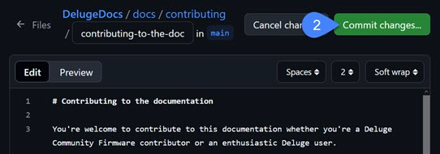

# Language style guide

To make the documentation consistent and accessible, you should try to align your content with the following style standards.

Best effort is much more important than perfection. Follow the style guide as best you can and allow others to edit your content to bring it in line with the style standards.

## Documentation structure

Content is organized by:

* Tabs
* Pages
* Sections

The tabs and left navigation are defined in `mkdocs.yaml`, and populated by individual `.md` files.
The right table of contents (ToC) for a page is defined by the sections (`##` and below) within the file.

### File naming conventions

Use lowercase, hyphenated names for all Markdown files, such as `getting-started.md`. Use consise and descriptive names. The file name should match the H1 heading for the page. It's okay to use abbreviations in the filename.

!!! example
        contributing-to-the-docs.md
        # Contributing to the documentation
    

## Page structure

Pages are structured as follows:

```
# Topic name

Author: Your Name (Optional)

1-2 paragraph introduction to help the reader determine whether they have found the content they want.

## Section

### Sub-section

```

### Headings

- Start each document with a H1 title (`# Title`).
- Use H2 (`##`) for primary sections, H3 (`###`) for subsections, and so on.
- Avoid skipping header levels.
- Include a blank line under headings for readability in the source Markdown.
- Use sentence case (capitalize only the first letter) for headings, such as `## Installation guide`.

#### Heading language

Use consistent heading language allows readers to build a mental model of the documentation and navigate more easily.

- For concepts, use a noun phrase, such as "Automation View".
- For tasks, use an "-ing" verb phrase, such as "Deleting a clip".
- For reference information, use a noun phrase with the type (list, table, and so on), such as "List of MIDI CC controls".

## Writing style

These style guidelines help make the documentation accessible to people from various language backgrounds and abilities.

### Tone

Use a clear, friendly, and professional tone. Talk to the reader as though they were a friendly business acquaintance. Contractions and informal language are okay.

Avoid casual language, slang, and humour because it doesn't translate well.

### Voice

Prefer the active voice, such as “Save your song by...” rather than “The song is saved by...”.

### Pronouns

Address the reader as “you” when giving instructions.

### Tense

Use present tense where possible, such as “Pressing **Back/Undo** reverts the last action”.

### Clarity

Aim for concise, plain language. Avoid jargon, idioms, and complex sentences.

## Page elements

### Lists

- Use for bulleted lists (`-`) when the order doesn't matter.
    - For consistency, use `-`, not `*`.
- Use numbered lists (`1.`) when the order matters, such as steps in a task.
    - Use `1.` for all items in the list, instead of `1.`, `2.`, `3.`. This makes it easy to update tasks without renumbering steps.
    - If there is only one step in a task, use `-` instead.
- Periods (`.`):
    - Use a period for lists of sentences.
    - Don't use a period for lists of nouns.
    - If any of the items in the list requires a period, use periods for the whole list.
- Keep list items parallel by:
    - Starting all items with a verb or all items with a noun.
- When introducing a list, end the paragraph with a colon (`:`).

!!! example
    The Deluge has three song-writing modes:

    - Arranger View
    - Song Rows View
    - Song Grid View

### Links
- Use descriptive text for links, such as [GitHub Markdown Guide](https://example.com) instead of [click here](https://example.com).
- Use inline links where possible, but reference links are okay if they improve readability.

### Images

#### Image files

- Use `.jpg`, `.gif`, `.png`, and `.svg` image formats.
- Put image files in `DelugeDocs\images`.

#### Image references
- Use relative image paths starting from the page location, such as `../../images/image.jpg`.
- Include alt text that provide a description of the image for accessibility.

!!! example

        


### Tables

- Use tables sparingly and only for structured data that is difficult to read in list format.
- Keep tables simple and focused on data, avoiding excessive width.
- Don't use tables to force a page structure.

### Providing examples

#### Introducing examples

- Use "such as" or "for example" (instead of "e.g.")
    - Prefer: "For more information, see the [GitHub Markdown Guide](https://example.com)"
    - Avoid: "For more information, [click here](https://example.com)"
- Use "that is" instead of "i.e."
- Use "and similar" or "and so on" instead of "etc."

#### Example steps

If you want to provide a series of steps to illustrate an example of a workflow, use an Example callout:

    !!! example "Creating a neurofunk bass"
        - Low pass filter with resonance
        - Add in the Saturation
        - Turn up both OSC Levels
        - Detune them slightly with Transpose -5 cent on OSC1 and + 5 cents on OSC2
        - Turn Synth Voices to 2 voices, and play with the voice detune amount
        - Adjust / Automate the Transpose detuning, filter cutoff, and distortion to taste. 


!!! example "Creating a neurofunk bass"
    - Low pass filter with resonance
    - Add in the Saturation
    - Turn up both OSC Levels
    - Detune them slightly with Transpose -5 cent on OSC1 and + 5 cents on OSC2
    - Turn Synth Voices to 2 voices, and play with the voice detune amount
    - Adjust / Automate the Transpose detuning, filter cutoff, and distortion to taste. 
