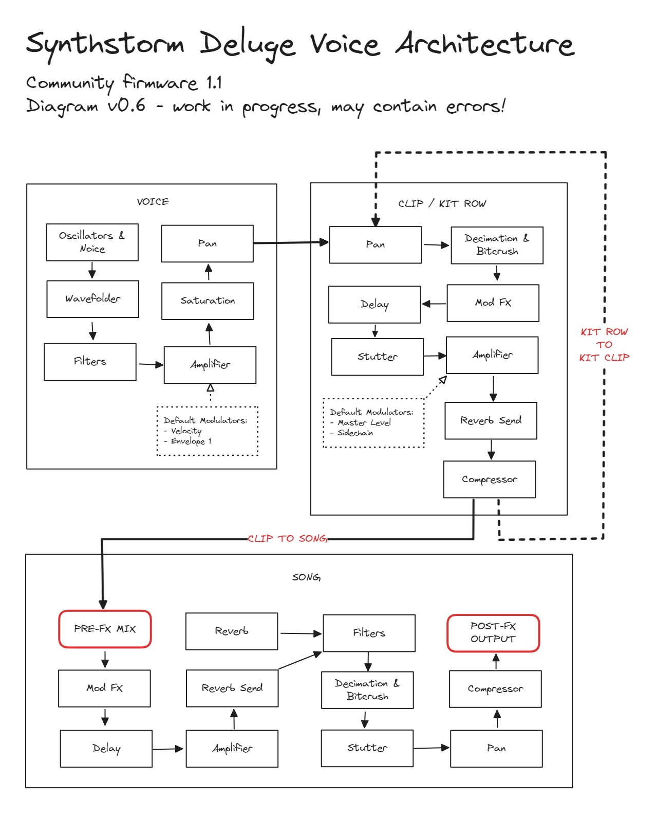
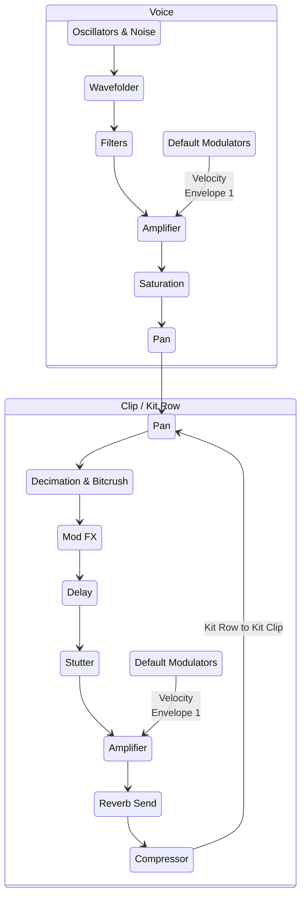

# Diagram

## Hardware

## Voice Architecture

``` mermaid
stateDiagram-v2
    state Voice {
        OscillatorNoise --> Wavefolder 
        Wavefolder --> Filters
        Filters --> AmplifierVoice
        DefaultModulatorsVoice --> AmplifierVoice: Velocity <br> Envelope 1
        AmplifierVoice --> Saturation
        Saturation --> PanVoice
        PanVoice --> PanClipKitRow
    }
    OscillatorNoise: Oscillators & Noise
    AmplifierVoice: Amplifier
    DefaultModulatorsVoice: Default Modulators
    PanVoice: Pan

    state ClipKitRow {
        PanClipKitRow --> DecimationBitCrush
        DecimationBitCrush --> ModFX
        ModFX --> Delay
        Delay --> Stutter
        Stutter --> AmplifierClipKitRow
        DefaultModulatorsClipKitRow --> AmplifierClipKitRow: Velocity <br> Envelope 1
        AmplifierClipKitRow --> ReverbSend
        ReverbSend --> Compressor
        Compressor --> PanClipKitRow: Kit Row to Kit Clip
    }
    ClipKitRow: Clip / Kit Row
    PanClipKitRow: Pan
    DecimationBitCrush: Decimation & Bitcrush
    ModFX: Mod FX
    AmplifierClipKitRow: Amplifier
    DefaultModulatorsClipKitRow: Default Modulators
    ReverbSend: Reverb Send
```