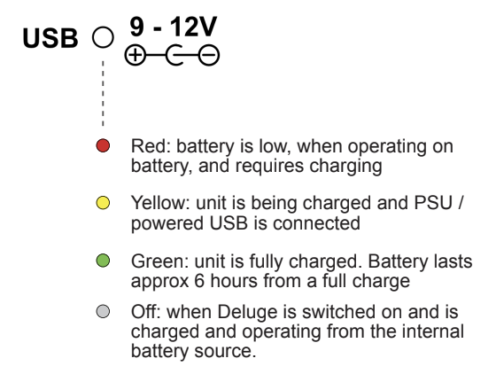

# Power

## Power overview

You can power the Deluge through the USB port or DC power socket.

The Deluge has an internal battery that can last for over six hours.

!!! info
    The internal battery is shipped with a low charge. When you use the Deluge for the first time, connect to a power source to charge the battety.

## Power Sources

### USB port

You can power and charge the Deluge through the USB Type-B port from any USB power source, such as a computer, USB wall adaptor, or powered USB hub. The Deluge draws up to 500mA from the power source.

### DC power socket

You can power and charge the Deluge with any centre-negative 9-12V DC power supply that outputs at least 500mA. The Deluge doesn't include this power supply, but you can buy one from a variety of manufacturers and shops.

  !!! warning
      The power supply MUST be centre-negative. Using the wrong type of power supply can damage the Deluge.

If the power supply provides enough current, you can connect the Deluge in series with other devices. Internal circuitry minimizes most ground loop noise, but some noise is possible.

If power is connected to the USB port and DC power socket at the same time, the Deluge draws power from the DC power socket.

### Battery

#### Charging the battery

The internal lithium-ion battery charges any time a power source is connected, whether the Deluge is on or off.

The battery status LED shows yellow for charging, green for charged, or red for low-battery.

#### Replacing the battery

You can replace the battery yourself. No special tools or skills are needed.

Replacement batteries should be type “18650” 3.7V Li-ion, either “protected” or “unprotected”. The original battery is 3000mAh, but you can use batteries of any capacity.

## Turning on the Deluge

1. Connect a power source to the USB port or DC power socket.

1. Install the SD card with the metal contacts facing up.

1. Switch the power switch on the rear of the device to **On**.

Deluge starts in Clip View with a blank song and one blank clip. The default preset ‘000 Rich Saw Bass’ is shown on the display.

1. Although the sequence can be played, the clips and song are blank.

1. You can play the synth manually using the right two columns of pads. These notes are arranged chromatically in C Major, 7-Note scale from bottom to top. The display shows the notes that you play.

