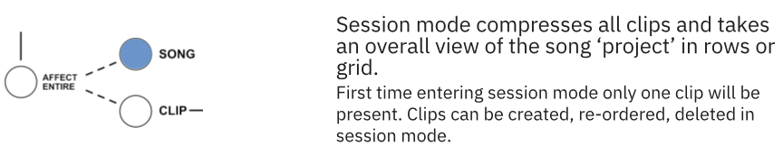
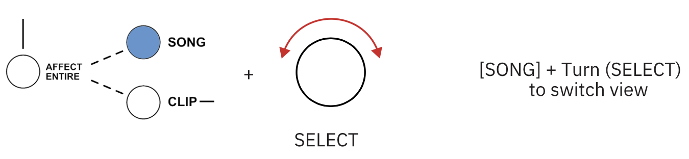
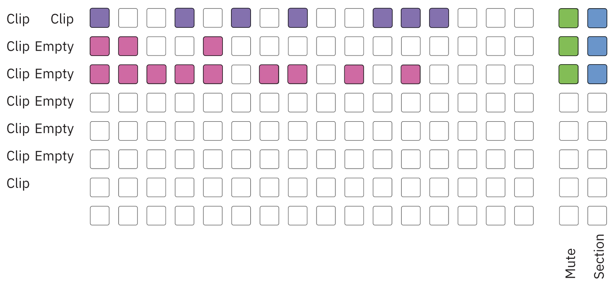
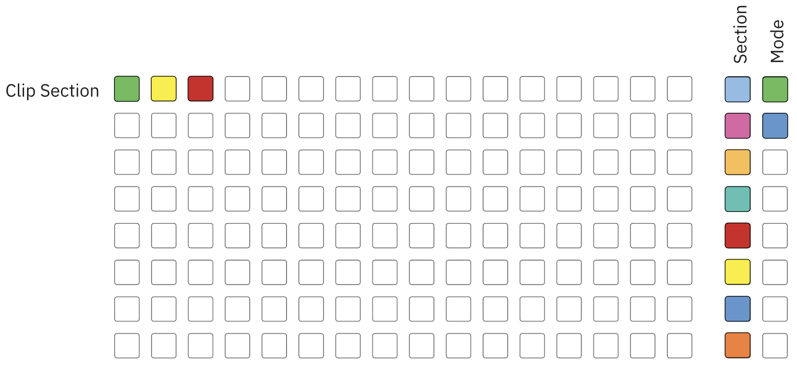

# Session Mode

Session mode consolidates all clips into a compressed view, with each clip shown as a row or as a single pad in a track column. Session mode is where all existing clips are managed together, new clips can be added, existing ones deleted and reordered. 

Session mode also provides controls to launch and stop clips and is also the main area to handle loop recording and playback.

> Diagram credit: [SynthDawg](https://www.synthdawg.com)

## Views

There are two views which are used to interact with session mode: [Session Row View (Default)](../../ui/views/session/session-row-view.md) and [Session Grid View](../../ui/views/session/session-grid-view.md). Select the view as follows:

### Session Row View
> Arrangement style presented with a clip per row.

### Session Grid View
> Session style grid consolidated into an instrument per column.

> Diagram credit: [SynthDawg](https://www.synthdawg.com)

