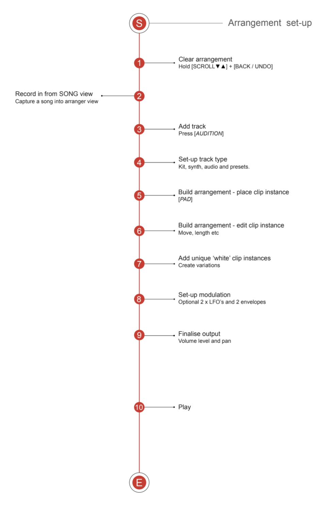

# Arranger Mode

Arranger mode allows the chaining of clip instances into a longer more linear arrangements. Session mode operates from the perspective of a collection of clips with each clip represented by a row (row view) or a single pad in a column (grid view). Arranger mode takes its perspective based on ‘tracks’. Each track is presented on a row and represents an individual Instrument, MIDI, CV or audio element. The pads therefore represent clip instances.

## Workflow

> Diagram credit: [SynthDawg](https://www.synthdawg.com)