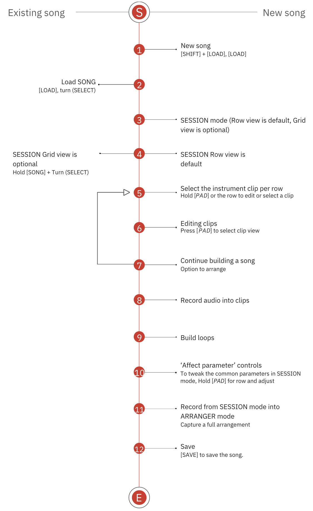

# Song

A song is a discrete creative endeavour, such as an arrangement, sketch, 8-bar loop, jam, live recording template, or musical experiment. A song is always associated with at least one song file on the Deluge.

## Workflow

An example high level workflow for working with SONGS on Deluge:

> Diagram credit: [SynthDawg](https://www.synthdawg.com)

## Master Settings and Parameters

There are a number of master settings and sound parameters that can be configured that apply to the entire song project.

### Settings

#### Scale

#### Swing

The swing feature provides a rhythmic adjustment that brings a more natural and organic feel to songs and operates generically and not at an individual note level.

The swing internal setting can be adjusted in the settings menu under swing interval and is saved as part of a song. New songs revert to default while saved and reloaded songs will retain the swing interval setting.

##### Adjusting the swing interval setting

1. Open the settings menu by pressing [SHIFT] + press (SELECT).
2. Turn the (SELECT) control to navigate the menu top level and select SWING INTERVAL
3. Press (SELECT)
4. Turn (SELECT) to choose between 2 bar, 1 bar, 2nd, 4th, 8th, 16th, 32nd, 64th, 128th note intervals. 16th is the default setting.
5. Press [BACK / UNDO] to back out of the menu when the parameter has been changed or at any time in the menu to back up.
6. The swing interval setting is saved as part of a song. New songs revert to default while saved and reloaded songs will retain the swing interval setting.

#### Tempo

Tempo can be set manually or a tap tempo option is available.

### Parameters

#### Level
#### Pan
#### Filters
#### FX

## Modes

There are two modes you can use to create and play a song on the Deluge: [Session](./song-modes/session-mode.md) and [Arranger](./song-modes/arranger-mode.md)
