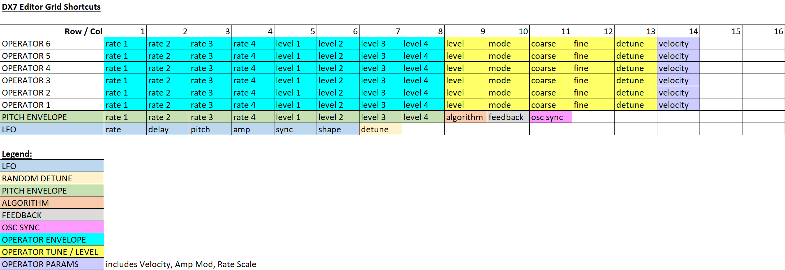

# DX7

## Description:

Oscillator type fully compatible with DX7 patches with full editing support.

The implementation is based on
[Music Synthesizer for Android](https://github.com/google/music-synthesizer-for-android) for the
"modern" engine, and [Dexed](https://github.com/asb2m10/dexed), for loading
of .syx patch banks as well as a tuned "vintage" engine.

Implemented as a special case of the subtractive engine, where OSC1 is changed to a new DX7 oscillator type.

It is possible to use the filters on a DX7 patch (though this increases CPU usage and decreases polyphony).

**Sean Note: Not sure that all of this will stay in this document as most of it is UI related, but putting it all here for now**

## Usage:

### Presets

Optional: place DX7 compatible patch banks in .syx format in a "DX7/" folder in the sdcard.

### Community Feature Setting

Enable the "DX SHORTCUTS" community setting for full access to the relevant UI behaviors.

### Create New Synth

#### Shortcut

To create a new synth in DX7 mode, use the new shortcut "CUSTOM 1" + "SYNTH".

This shortcut has to be used to create a new DX7 synth
rather than changing the osc type of a existing patch (or the default init patch)
as it sets up better defaults, like opening the map ENV1, so the
DX7 envelopes can be heard, and no default VELOCITY->global volume
modulation, as velocity sensitivity is set per operator anyway.

#### DX7 Menu

This shortcut will show up a menu. The first option in this menu lets you load patches.
First you browse for .syx files in the folder (nested subdirs are allowed).
After selecting a file, you will get a list with the 32 patches in the back.
Make sure to enable "KEYBOARD", to be able to audition different patches while browsing through.

If you want to create a patch from scratch, you can use the second "DX7 PARAMETERS" option,
or just exit the menu to use the shortcuts for editing (see Community Feature Setting above for access to all shortcuts).

To re-enter this menu later, use the shift+osc1 type shortcut and press SELECT when DX7 value is active.

#### Community Feature UI

##### Keyboard View Sidebar

For interactive editing you likely want to use the DX7 sidebar in Keyboard View to quickly jump to relevant operator parameters.

With the community setting active, this column will automatically appear as the right column,
unless it was manually set to something else.

When the Keyboard view is active, the first 6 rows of the sidebar shows the operators as green for a carrier and blue for a modulator.

1. Taping a single pad in isolation lets you switch an operator on or off. 

2. Pressing Shift+coloured pad opens the editor for that operator. 
- The first press of Shift+colored pad selects the level parameter.
- Pressing Shift+coloured pad again select the COARSE tuning parameter.

3. Pressing shift+the seventh pad will open up the editor for global parameters, starting with algorithm and feedback.

##### Editor View

Inside the editor view (when the sidebar is flashing), the LEFT-RIGHT encoder can be used
to browse between parameters.

1. Some parameters have a shortcut in a layer which is only active when editing any DX7 parameter (otherwise the regular synth shortcuts apply). This shortcut layer is outlined as follows:

- The first 6 rows correspond to the operators.
- The seventh and eight row contain some of the global parameters

2. If OLED screen is available a group of related parameters is displayed at a time, like all the envelope levels and rates
for a specific envelope. With 7SEG the parameter name will be shown briefly before the value

3. Press back/undo to exit the Editor View, and access the standard synth shortcuts again.

## Engine versions

Two engine versions are available, "modern" and "vintage", as well as the "auto" engine
mode used by default.

Auto will use the "modern" engine for _most_ algorithms
is chosen as it offers higher polyphony via an optimized SIMD implementation.
However when feedback is activated on algorithm 4 and 6 (those will multi-operator feedback),
"auto" will instead use the "vintage" engine as the modern one doesn't implement these algorithms properly.
"vintage" engine is meant to more accurately model a DX7 synth, but has lower polyphony.

## Patch Sources
Need some DX7 patches? Check out the following:

 - [DX7 factory banks](https://yamahablackboxes.com/collection/yamaha-dx7-synthesizer/patches/) from Yamaha Black Boxes.
 - [Bobby Blue's "All The Web"](http://bobbyblues.recup.ch/yamaha_dx7/dx7_patches.html) patch collection.
 - [This DX7 Cart Does Not Exist](https://www.thisdx7cartdoesnotexist.com/), a random patch bank generator.
 - [patches.fm](https://patches.fm/patches/) has over 20,000 individual patches.
 - [The Dexed home page](https://asb2m10.github.io/dexed/) links to "Dexed Cart 1.0" which is a collection of ~5000 DX7 patches. Reddit user [Finetales on /r/synthesizers](https://www.reddit.com/r/synthesizers/comments/e4jkt7/my_curated_dexeddx7_patches_3_banks/)  narrowed this down to just 3 carefully curated banks.

## Missing features:

- [ ] midi implementation
- [ ] modulating/automating individual operators