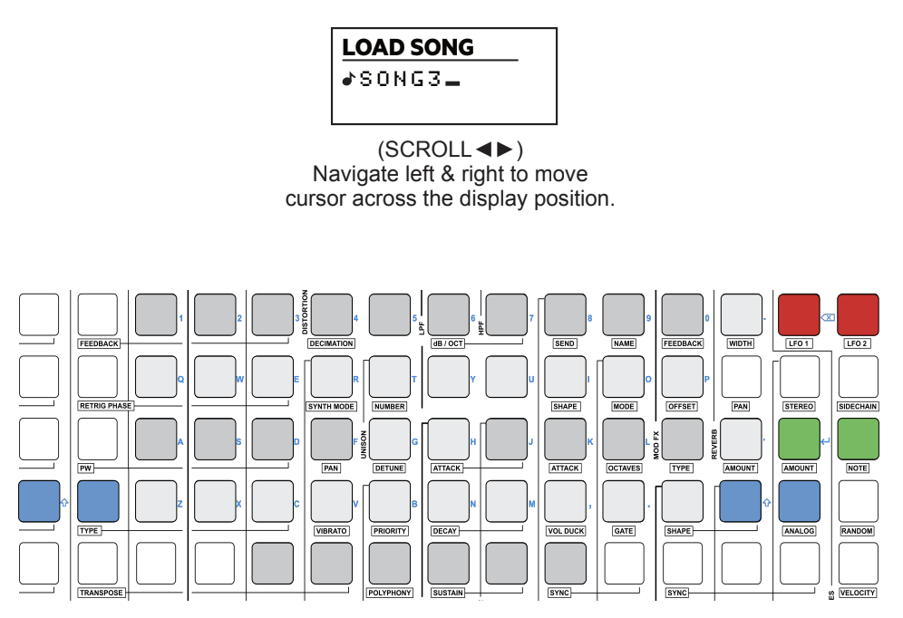

# Alphanumeric Keyboard

Deluge has an alphanumeric keyboard function within the 16x8 pad grid. This enables text entry for naming of songs, clips, etc. The default setting is QWERTY mode (can be changed in settings) and the keyboard is highlighted on the grid and available automatically when text entry options are available such as when saving, file browser, etc. Tapping a pad when loading or saving will bring the keyboard into view and automatic predictive text entry is provided based on Deluge analysing existing file names.

The shift, enter, backspace buttons are coloured and double up on pads for the function. Spacebar is the bottom row of 6 pads. Once the name has been typed in it is confirmed / saved by pressing ‘RETURN’ i.e. ‘amount’ or ‘note’ pads lit green.

## Setting the alphanumeric keypad style

1. Press [SHIFT] + press (SELECT) to open the settings menu.
1. Turn (SELECT) to choose the PADS option.
1. Press (SELECT)
1. Turn (SELECT) to choose KEYBOARD FOR TEXT.
1. Press (SELECT)
1. Turn (SELECT) to choose the desired keyboard style from.
    - QWERTY - Default to match grid layout.
    - AZERTY
    - QWERTZ
