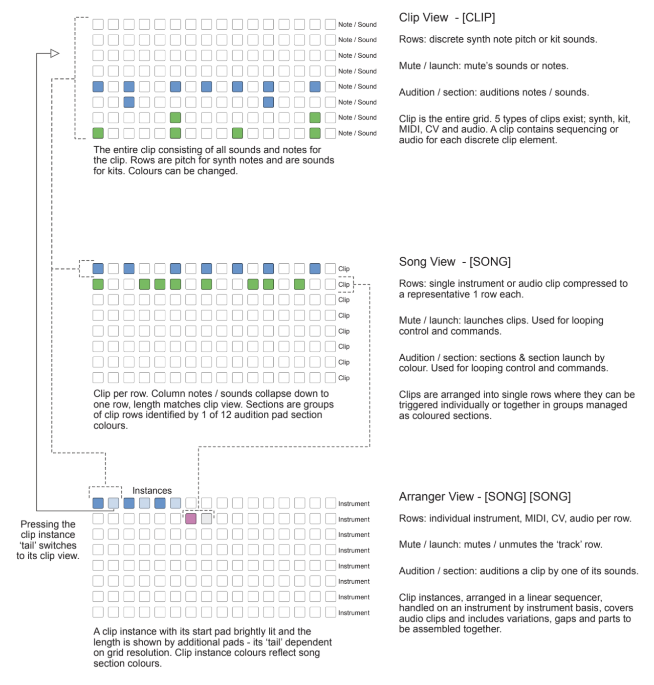
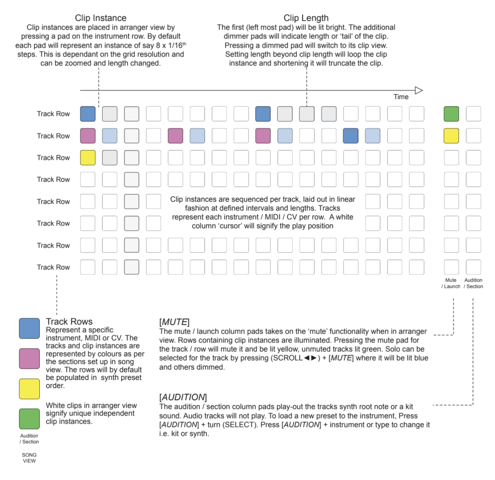
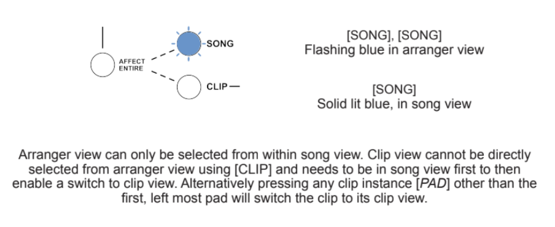
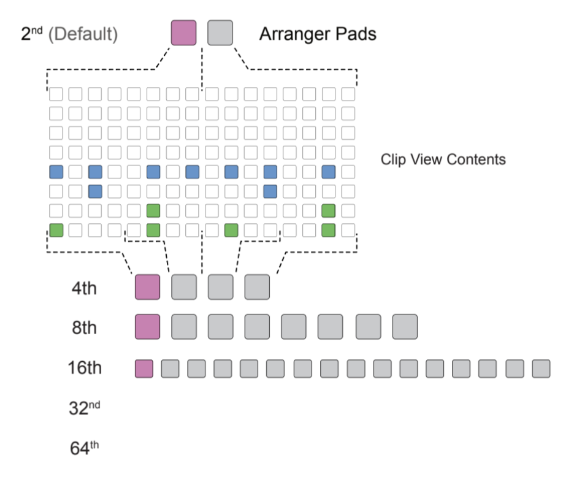

# Arranger

Arranger view allows the chaining of clip instances into a longer more linear arrangements.

## Relationship Between Views

Arranger view consists of a group of linearly arranged instrument and audio clip instances of which reference the section colours from those in session view. Think of arranger view as an extension of session view rather than a stand-alone function. Understanding the relationship with clip, song and arranger is important.

> Diagram credit: [SynthDawg](https://www.synthdawg.com)

## Basics

### Layout

Arranger view takes its perspective based on ‘tracks’. Each track is presented on a row and represents an individual Instrument, MIDI, CV or audio element. The pads therefore represent clip instances.

> Diagram credit: [SynthDawg](https://www.synthdawg.com)

### Notes when working in Arranger View

- Clip, song and arranger views are not independent functions. They offer different personas and views and are specific tools when working on the same project and its common data (notes, kits etc).
- Clip ‘instances’ are identical, linked copies of the original clip. Changing the instrument notes, structure of the actual clip will change equally in all instances.
- Each row represents a track. Only one row per instrument, MIDI, CV, audio and therefore each instance resides on the same row.
- Clips including the length and song sections should be set up first. These form a prerequisite to arranging the clips in arranger view.
- Colours of clips in arranger view reflects the colours for the respective section in song view.
- White clips in arranger view indicate unique clip instances which are independent, detached from any original source clip. Used for variations and fills.

### Selecting Arranger View

1. Select [SONG] view.
1. From within song view, press [SONG] again to switch to ARRANGER view. The song button will flash blue.
1. Press [SONG] again to return back to song view - button lit blue.

> Diagram credit: [SynthDawg](https://www.synthdawg.com)

### Basic clip instance placement in the Arranger

1. Ensure a collection of clips have been produced in clip view, lengths set and arranged as desired and with sections in song view as desired.
1. Select [SONG] for arranger view. Button flashes blue.
1. Arranger view is entered.
- The grid will be initially blank.
- The mute / launch pads will be lit. For example, if 3 instruments are used in song view, maybe each with several clips each, then 3 rows will be set for the three instruments.
- The audition / section pad can be played to listen to a selected sound, ie: snare from a kit or the root note from the synth preset for the specific instrument. Holding down on audition pad will reveal the name of that preset in the display.
- Rows will default to presets when the audition pad is played for an instrument not used with a clip.
1. Press a [PAD] for the location at the start of the clip instance and on the row for the desired instrument.
- The pad will illuminate to match the song section colour.
- The length will be set based on the original clip length and displayed based on the arranger grid resolution.
- The length will be indicated by the pads following the first solid lit pad - the additional pads or the ‘tail’ will be dimly lit.
1. Press a ‘tail’ pad to switch back to its clip view. Pressing [SONG] in clip view having switched from the arranger, returns the view back to arranger.
1. Repeat to add more clip instances. Clips placed on the grid will default to the same section colour as the last clip instance placed.

### Changing the clip instance on the same instrument

1. Press & hold [PAD], the clip instance to change + turn (SELECT).
1. The clip instance options available will be selected with the select control. The pad will change its colour based on its section colour in song view.
1. Changes will take place at every ‘click’ iteration of the select control knob.

### Playing tracks in Arranger

1. Press [PLAY] the tracks will play from the start.
1. Press & hold (SCROLL◄►) + [PLAY] to play from desired/current scroll position.
1. Press [PLAY] to stop playback.
1. A white column ‘cursor’ will step through the grid in time with the sequence. Any muted rows / instruments will be shown muted yellow on the cursor. Press [CROSS-SCREEN] to switch between the cursor remaining fixed and the arrangement moving from right to left, or the cursor scrolling through the arrangement.

### Inserting or deleting time slots in Arranger

1. Press [SHIFT] + turn (SCROLL◄►) will move all the clip instances currently visible on the grid left or right in time.
1. Moving the clips right - turn clockwise, will insert time space before the first clip, moving the existing clip instances later in time.
1. Moving the clips left - turn anti-clockwise, will remove any time available before the first clip, or delete clips as they ‘drop off’ the left side of the grid.

Note: Undo / redo options are available within the arranger view. This may be particularly useful if clips are deleted when removing time from the arranger grid.

### Extending / Reducing a Clip Instance Length

1. Press & hold [PAD], the first, brightly lit pad + [PAD] on the same row.
1. Placing the second [PAD] longer than the original length will extend the clip instance, looping its content for the new duration.
1. Placing the second [PAD] shorter than the original length will mean the clip playback will truncate at the new end location.
1. The length will show a bright first pad and dimmer ‘tail’ pads for the clip instance length.

### Setting the Arranger Grid Resolution

1. Press (SCROLL◄►) when in arranger view to display the current grid resolution setting. Default is 2nd
1. Press & turn (SCROLL◄►) to change the grid resolution for the clip instances.
1. Options available will determine how the clip is displayed on the grid with respect to the clip length. For a 16 x 16th steps / 1 bar:-

> Diagram credit: [SynthDawg](https://www.synthdawg.com)

### Adding / Changing Track Directly in Arranger View

1. Press & hold [AUDITION] - unassigned audition pad + turn (SELECT) to select an available preset for the track row.
1. To change an existing preset:
- Press & hold [AUDITION] pad for the instrument / row to change + turn (SELECT) to scroll the presets.
or
- Press & hold [AUDITION] pad for the instrument / row to change + track type [SYNTH], [KIT], [MIDI], [CV].
or
- Press & hold [AUDITION] pad for the instrument / row to change + press (SELECT) for an audio track.

### Soloing Track in Arranger

1. Press & hold (SCROLL◄►) + [MUTE] of the selected row to solo.
1. Mute button for the row illuminates blue. Other row tracks are dimmed.

## Reordering an instrument track in Arranger

1. Press & hold [AUDITION] pad of the selected row to move + turn (SCROLL▼▲).

### Deleting a Track in Arranger

1. Press & hold [AUDITION] of the selected row to delete + [SAVE].
1. Instrument track will be deleted or display will indicate if the instrument cannot be deleted.

### Clearing all Clip Instances in Arranger

1. Press & hold (SCROLL▼▲) + [BACK / UNDO].

## White Pads for Variations

While arranger view generally uses existing, song section coloured clips to build up an arrangement, there is also a ‘white’ instance clip option. White clips are unique and special clips that can be edited independently and used to add one off fills and variations in an arrangement.

### Creating a Blank White Clip

1. Press & hold [PAD], the clip instance to create + turn (SELECT).
1. The clip instance options available will be selected with the select control. The pad will change its colour based on its section colour in song mode.
1. Select a WHITE clip and then release the pad.
1. A new blank clip instance is created that is not connected to any other clip nor is it featured in the song view.
1. Pressing the clip ‘tail’, not the left most pad, will switch to clip view, where no notes or sound patterns exist.

### Creating a new white clip variation pattern

1. After creating a blank clip, pressing the dimly lit [PAD] clip ‘tail’, not the left most bright pad, will switch to clip view.
1. The clip will currently be a blank instrument clip.
1. The default preset and instrument will be as per the instrument row where the white clip resides in arranger view.
1. Create a new pattern that will form a variation from the other clip instances on the same instrument row. For example a crash cymbal or drum fill for the end of a sequence part.
1. Press [SONG] which will return back to the arranger view.
1. The white clip will now host a unique variation from the other clips by playing the one off pattern from the recently created clip.

### Convering an existing clip instance to a white clip

1. Press [SHIFT] + [PAD] of an existing coloured clip instance. This will be a clip instance which instead of creating a new variation, will be edited from its existing pattern to form the variation.
1. The clip instance left most pad will turn white. Other ‘tail’ pads forming its length may be coloured dimly based on the clips event colours.
1. Pressing the dimly lit [PAD] clip ‘tail’, not the left most bright pad, will switch to clip view.
1. The clip will contain the existing note and sound events and pattern. These can be edited to form a unique variation from the original pattern.
1. Press [SONG] which will return back to the arranger view.
1. The white clip will now host a unique variation from the other clips by playing the one off pattern from the recently edited clip.

## Advanced Actions

Arranger view is a powerful persona and view within Deluge. Understanding the basics is important to get started. More advanced functions also exist to integrate tightly with song view and align common functions such as song and clip playback.

### Opening clips in arranger directly from song view

1. Select song view [SONG], button is lit solid blue.
1. Press & hold [PAD], the clip row to drag to arranger + press (SONG).
1. The view will switch to arranger.
1. While still holding the [PAD] in arranger view, turn (SCROLL◄►) to locate the position to a column across the instrument row.
1. Release [PAD] to drop the clip instance in the arranger grid.

### Opening clips in song view directly from arranger

1. Select arranger view [SONG], [SONG]. Button flashes blue.
1. Press & hold [PAD], the clip instance to drag to song view + press (SONG). The typical use would be to drag over a white clip, which by default doesn't exist in song view.
1. The view will switch to song view.
1. While still holding the [PAD] in song view, turn (SCROLL▼▲) to locate the position within the clip rows.
1. Release [PAD] to drop the clip into the song grid row position.
1. Once in song view, the clip will change from white to an assigned section and its associated colour. This colour will now be reflected in the clip instance in arrangement view.

### Synchronising playback between views

- In arranger view:
1. Press the dimly lit [PAD] clip ‘tail’, not the left most bright pad, which will switch to clip view.
1. Pressing [PLAY] after entering clip view this way will start playback in the arranger from the beginning of this clip instance.

- In arranger view:
1. Press [PLAY] to play back the arrangement.
1. Switch to song view [SONG], button lit solid blue.
1. The pads will be lit slightly dim while arranger controls the transport playback.
1. Control can be regained within the song mode. Sections and clips can be triggered in song mode which override the arranger.

- In song view:
1. Press [PLAY].
1. Press [SONG] which will switch to the arranger view.
1. Turn (SCROLL◄►) to set the playback start position in the arranger view.
1. Press & hold (SCROLL◄►) + [PLAY] to start arranger playback from the new position once the song loop completes.

### Changing a tracks preset when in Arranger View

1. Press [AUDITION] pad to hear the instrument / sound for the row.
1. Press & hold [AUDITION] pad for the instrument / row to change + (SELECT) to scroll the presets.
or
1. Press & hold [AUDITION] pad for the instrument / row to change + track type [SYNTH], [KIT], [MIDI], [CV].
or
1. Press & hold [AUDITION] pad for the instrument / row to change + press (SELECT) for an audio track.

## Capturing an entire song session in Arranger View

Triggering of clips, sections and changing parameters can be performed in song view. This in turn can be captured as clip instances within arranger view. This allows entire performances to be recorded either as a planned production or as an on-the-fly improvisation.

### Recording into arranger directly from Song View

1. Select song view [SONG], button is lit solid blue.
1. Press [RECORD] + [SONG] to activate recording*. Both buttons will quickly flash indicating recording to arranger mode is active.
1. During recording:
- Switching to clip or arranger view is deactivated.
- Clips cannot be deleted.
- Parameters in song view can be changed by holding a clip [PAD] and changing the (UPPER) & (LOWER) controls for the selected parameter. These are recorded but will automatically create a cloned clip version.
- Adjust external MIDI controllers to record associated parameter changes.
- Instant-launch a clip by [SHIFT] + [LAUNCH] will be placed in the arrangement as if it had been played from the start of that loop.
- Play clips of which its instance will be recorded into the arranger in relevant rows. The instances are directly linked to the original so changes later will reflect in the recorded instance. Clone clips later in the arranger to create unique versions.
- Play an external MIDI controllers live to record notes. These are recorded but will automatically create a cloned clip version.
1. To end recording; press [RECORD] to end playback, or press [PLAY] or press [SONG].

Note: Arrangement recording will begin from wherever your current scroll-position is in arranger view. Default for new songs is 0. Anything which previously existed to the right of this start-point is immediately deleted to make way for the new recording. [BACK / UNDO] & [REDO] are available functions and can restore whatever arrangement existed previously.