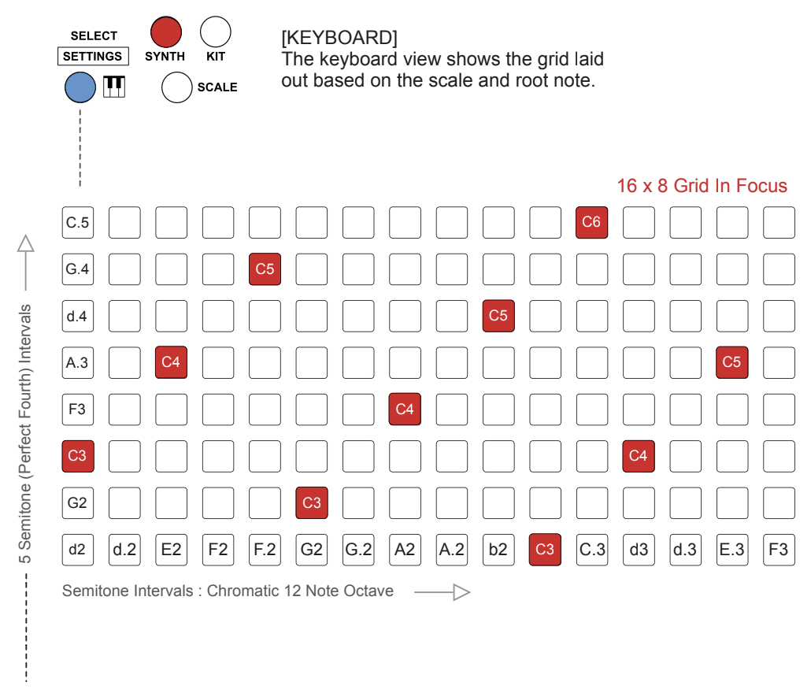
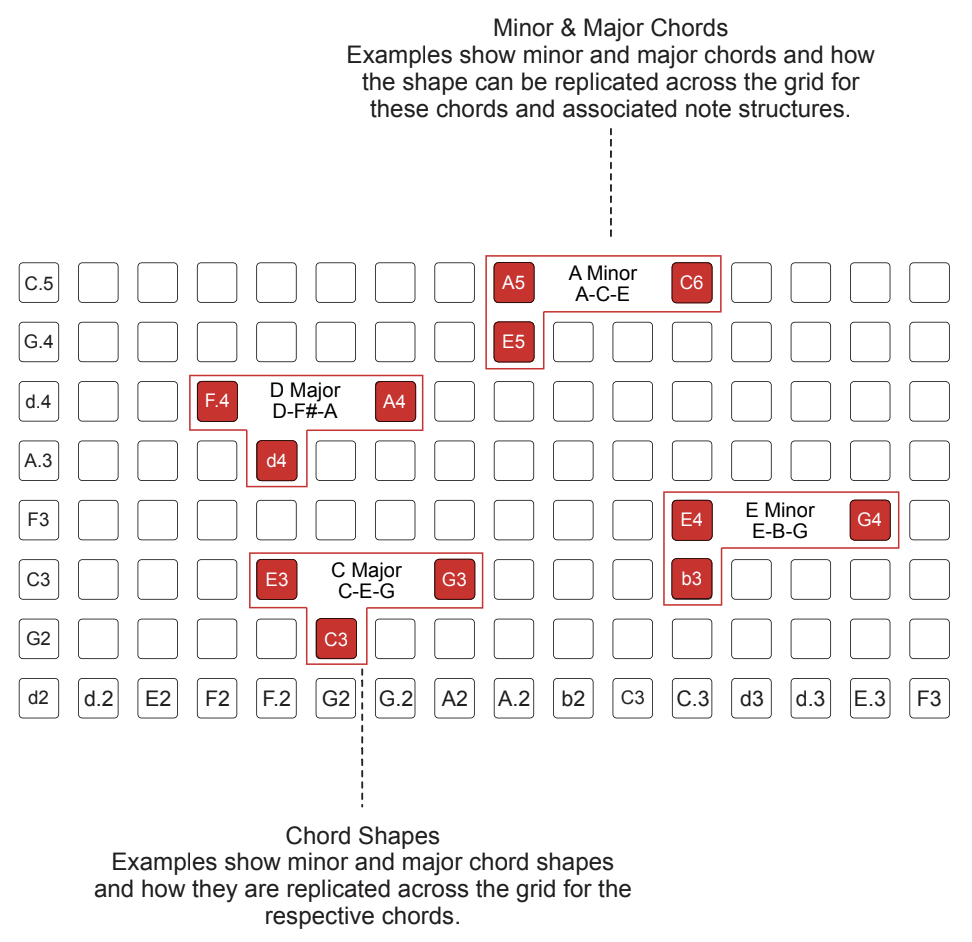

# Melodic Instrument Clip Keyboard

The Melodic Instrument Clip Keyboard view is selected by pressing KEYBOARD from the Instrument Clip View for Melodic Instrument Track Types: Synth, MIDI and CV. 

Deluge has two melodic instrument keyboard views that are enabled by default: isomorphic and in-key. 

Three additional keyboard layouts can be enabled in the community settings menu:

1. Norns
1. Chord
1. Chord Library

## Changing the scale

In the Isomorphic and In-Key keyboard layouts, the scale can be changed if scale mode is active.

Hold [SCALE] + press (SELECT) to cycle through the scales available. The scales will be displayed as they are changed.

## Changing the root note

In the Isomorphic and In-Key keyboard layouts, the root note can be changed if scale mode is active.

In the keyboard view the root note can be changed. Hold [SCALE] + turn (SELECT) to cycle through the notes available. The note will be displayed while being changed.

## Set the default keyboard layout

1. Hold [SHIFT] + press (SELECT) to open the settings menu.
1. Turn (SELECT) and highlight the ‘DEFAULTS’ option.
1. Press (SELECT) to select and open the defaults sub-menu.
1. Turn (SELECT) and highlight the ‘UI’ option.
1. Press (SELECT) to select and open the UI sub-menu.
1. Turn (SELECT) and highlight the ‘KEYBOARD’ option.
1. Press (SELECT) to select and open the song view sub-menu.
1. To change the layout that is presented by default for the keyboard select ‘LAYOUT’. Press (SELECT) to open the sub-menu and turn (SELECT) to choose between ‘IN-KEY’ and the default ‘ISOMORPHIC’ options.
- ISOMORPHIC. Default start view is isomorphic when selecting the
[KEYBOARD] option.
- IN-KEY. Default start view is in-key when selecting [KEYBOARD].

## Changing the keyboard layout

To change the layout, Hold [KEYBOARD] + turn (SELECT).

## Layout Types

### Isomorphic

Keyboard layout which is reflective of the scale and is mapped to the 16 x 8 pad grid.

This means that the grid has defined note and chord placements rather than traditional piano style sequencing layout. The Deluge column steps are one semitone and the rows five semitones (a perfect fourth) apart. In layout terms, it is therefore more akin to a bass guitar fretboard than it is to a piano keyboard. From a grid playability perspective this makes perfect sense. Pressing a note on the grid will also highlight the equivalent notes, up and down an octave, on the grid.

* Diagram credit: [SynthDawg](https://www.synthdawg.com)

Steps up the rows in five semitone (perfect fourth) intervals and the columns steps in one semitone steps.

Note Offset:

- The row step / note offset is adjustable and is saved with the song.
- Press [SHIFT] + turn (SCROLL◄►) to adjust.
- Default setting is 5 but can be set to 12 for an isomorphic keyboard.

These octaves will follow a consistent pattern shape of the notes between the octaves. Chords played on a piano are shaped uniquely across the scale (for example 12 chord shapes in a minor chord for each root note).

In the isomorphic layout, chords always follow the same shape.

Example of Isomorphic Chord Shapes:

* Diagram credit: [SynthDawg](https://www.synthdawg.com)

More isomorphic chord examples are shown in the community quick reference guide in section 15 of this manual. The row step / note offset can also be adjusted from the default ‘5’ setting.

**to do**: include the additional chord shape examples

### In-Key

...insert description of in-key keyboard layout...

In-Key mode removes from the display any notes / pads that are not in the scale. 

### Chord

...insert detailed chord layout documentation...

### Norns

The Monome Norns uses a mod named Midigrid to communicate with Deluge by sending notes continuously on MIDI channel 16. First install Midigrid mod on Norns and enable it. Connect Deluge to Norns via USB to establish a MIDI connection. Create a MIDI clip on Deluge and set the MIDI clip to channel 16. Switch to Norns keyboard view on the MIDI clip, then load a script on Norns.

Norns view renders the grid pads with white consecutive notes representing the incoming MIDI. Velocity is also represented by the pad brightness.

To light up a pad on the grid, Norns sends a note and velocity info to deluge, then deluge converts it to LED. A blinking pad LED could be the "tempo" instead depending on the script on Norns. Norns view on deluge acts as a controller for the script that is running on Norns, so it's not specifically "velocity" being displayed in this context for Norns, but in other keyboard views, pad brightness corresponds to velocity if that feature is enabled. There's more specific documentation for this in the norns midigrid forum thread. 

For more information, refer to the Norns Midigrid documentation: https://llllllll.co/t/midigrid-use-launchpads-midi-grid-controllers-with-norns/42336