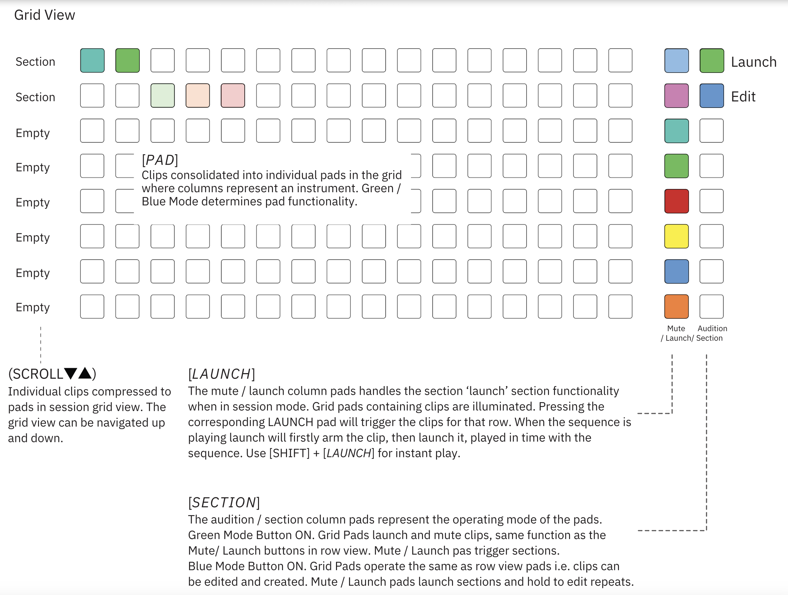

# Session Grid View

An optional way of presenting the session mode is to use the grid view. Generally speaking this still offers the same core session mode functionality but is presented with a grid style as opposed to a row view and the play and edit modes need to be selected. The functions in row or grid view are generally the same but with some visualisation and application differences. 

> Diagram credit: [SynthDawg](https://www.synthdawg.com)

Deluge will only play one clip per track at one time in row view. So for example, if two clips use the same synth preset 1 or clone of 1, the clip rows can each be launched but each one will stop playback of the other, allowing only one clip instance of each track to play at one time.

## Default Behaviour

You can change the default behaviour of session grid view in the settings menu.

1. Hold [SHIFT] + press (SELECT) to open the settings menu. 
1. Turn (SELECT) and highlight the ‘DEFAULTS’ option. 
1. Press (SELECT) to select and open the defaults sub-menu. 
1. Turn (SELECT) and highlight the ‘UI’ option. 
1. Press (SELECT) to select and open the UI sub-menu. 
1. Turn (SELECT) and highlight the ‘SONG’ option. 
1. Press (SELECT) to select and open the session view sub-menu.
1. Turn (SELECT) and highlight the 'GRID' option.
1. Press (SELECT) to select and open the session grid view sub-menu.
1. Turn (SELECT) to choose:

    - DEFAULT ACTIVE MODE. Default start mode as Green, Blue or Selection Mode. "Selection" allows changing the mode as described below, all other settings will always make mode snap back to the configured one (default is selection)
    - SELECT IN GREEN MODE: Disable or Enable. Enabling this will allow the green (launch) mode button to be held to change their parameters. This is similar to blue mode, tradeoff is arming is executed on finger up (default is enable).
    - EMPTY PADS: 
        - UNARM: Disable or Enable. Enabling will set the behaviour so that pressing empty pads in a track will also unarm all playing tracks in that track (default is disable)
        - CREATE + RECORD: Disable or Enable.

## Playing a Song

1. Press [SONG] to switch to session mode. The button illuminates blue. If this is a new song and the first this time the session mode is selected, the selected view will only show the first clip compressed to the first row.

1. Hold [SONG] + turn (SELECT) to change between song row and grid views. Select row view.

1. Press [PLAY] to playback the song.

1. The grid of pads represents consolidated clips and sections. Only the first clip in a section is visible on a pad. Track column colours are randomly generated.

1. Press [PLAY] to stop and reset playback position to the song start.

## Creating a new clip

1. Press [SONG] to switch to session mode. The button illuminates blue. 

1. Press [SONG] + Turn (SELECT) to switch to grid view.

1. Press the blue [AUDITION] pad to select pad edit, blue mode.

1. Press a [PAD] from the empty, unlit pad on the 16 x 8 main grid, starting in the first column of next available column. Select from an existing column to use the same instrument.

1. Deluge creates a new clip and transfers the view from session to clip view with synth selected by default.

1. Any edits, change to synth / kit, steps created etc in the clip will be reflected when switching back to session grid view with the clip added.

1. Alternatively hold [PAD] + Turn (SELECT) to assign an instrument directly from within session grid view.

## Selecting an existing clip to edit

1. Press [SONG] to switch to session mode. The button illuminates blue. 

1. Press [SONG] + Turn (SELECT) to switch to grid view.

1. Press the blue [AUDITION] pad to select pad edit, blue mode.

1. Press a [PAD] of any occupied row from the 16 x 8 main grid. The occupied pads containing clips will be illuminated fully or in part.

1. Deluge transfers the view from session to clip view ready to edit.

1. Any edits, for example, steps created in the clip will be reflected when switching back to session grid view

Note: Loop / Overdub recording of non-audio clips is not supported in Session Grid View. These functions should be performed in the default session row view.

## Launch control of single clips

More advanced options are available in session rid view than just the start stop commands for individual clips. Clips are armed to ensure the timing of the clip start aligns with the overall song.

> Diagram credit: [SynthDawg](https://www.synthdawg.com)

Display shows countdown of loops / beats remaining when a clip pad / section is ‘armed’ and launching or stopping clips, default is 1. To increase the loops to play prior to launch / stop, turn (SELECT) to change the loop countdown.

Press (SELECT) to cancel loop countdown.

Press [SHIFT] + [LAUNCH] pad to immediately play the clip row in session grid view.

## Launching / stopping a clip or section

## Adjusting armed countdown on the fly

## Soloing clips

## Copying a clip

## Changing a clip colour