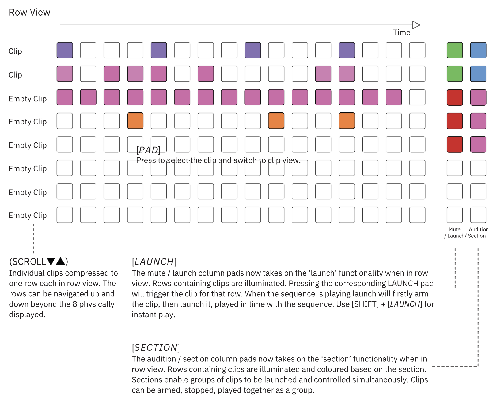
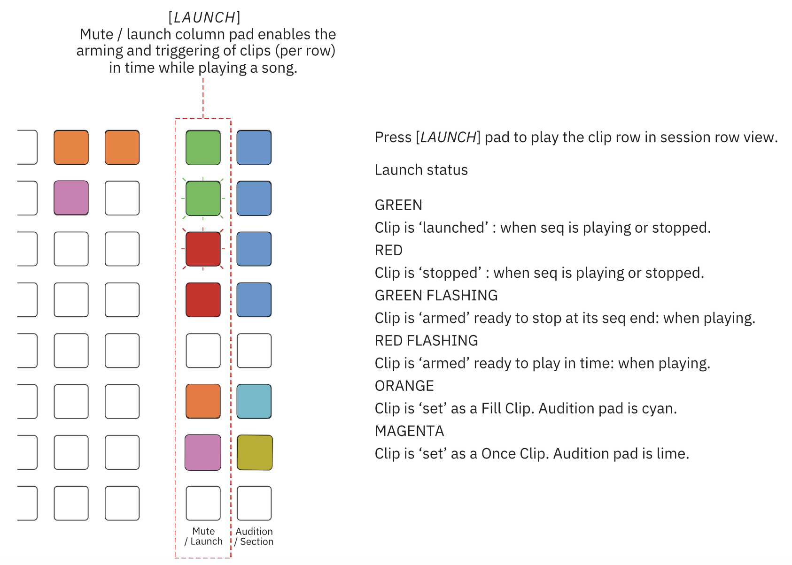

# Session Row View

The default session mode presentation is ‘row’ view. This shows a clip per row. A clip for an instrument can be launched individually or within a section along with other different instruments.

> Diagram credit: [SynthDawg](https://www.synthdawg.com)

Deluge will only play one clip per track at one time in row view. So for example, if two clips use the same synth preset 1 or clone of 1, the clip rows can each be launched but each one will stop playback of the other, allowing only one clip instance of each track to play at one time.

## Playing a Song

1. Press [SONG] to switch to session row view. The button illuminates blue. If this is a new song and the first this time the song mode is selected, the song may be empty or only show the first clip compressed to the first row.

1. Press [PLAY]. Song will playback and the white song position cursor will travel left to right.

1. Rows occupied by clips are lit and the audible [LAUNCH] pads will be green while the [SECTION] pads are lit blue as default but the colour may be changed to reflect the actual section assigned.

1. Press [PLAY] to stop and reset playback position to the song start.

## Creating a new clip

1. Press [SONG] to switch to session row view. The button illuminates blue. 

1. Press a [PAD] of any empty, unlit row from the 16 x 8 main grid. 

1. Deluge creates a new clip and transfers the view from session row view to clip view with synth selected by default. 

1. Any edits, change to synth / kit, steps created etc in the clip will be reflected when switching back to row view with the clip added as a compressed single row.

1. Alternatively hold [PAD] + Turn (SELECT) to assign an instrument directly from within session row view.

## Selecting an existing clip to edit

1. Press [SONG] to switch to session row view. The button illuminates blue.

1. Press a [PAD] of any occupied row from the 16 x 8 main grid. The occupied rows containing clips will be illuminated fully or in part.

1. Deluge transfers the view from session row view to clip view ready to edit.

1. Any edits, steps created etc in the clip will be reflected when switching back to session row view.

## Moving a clip

1. Press [SONG] to switch to session row view. The button illuminates blue.

1. Press & hold a [PAD] within the clip row to move + turn (SCROLL▼▲).

1. The clip will be relocated into a different row relative to the other clips.

## Changing clip colour

1. Press [SONG] to switch to session row view. The button illuminates blue.

1. Press & hold a [PAD] + hold [SHIFT] + turn (SCROLL▼▲).

1. The clip row colour will be adjusted.

## Changing clip mode

1. Press [SONG] 

1. Hold [LAUNCH] + press (SELECT) on an existing clip row.

1. The clip settings menu will appear.

1. Enter the clip mode sub menu.

1. The infinite clip mode is normally but can be changed to fill or once.

1. Turn (SELECT) to highlight ‘FILL’ or ‘ONCE’.

1. Press (SELECT) to select and confirm the option highlighted.

1. Press back [BACK] to exit the clip settings menu.

1. The clip playback will operate according to the behaviour of the clip mode selected.

## Launch Control of Single Clips

More advanced options are available in session row view than just the start stop commands for individual clips. Clips are armed to ensure the timing of the clip start aligns with the overall song. The catch notes option in the community feature settings considers the behaviour of clip transitions to allow for ‘in progress’ note timing or instant switching. 

> Diagram credit: [SynthDawg](https://www.synthdawg.com)

Display shows countdown of loops / beats remaining when a clip row is ‘armed’ and launching or stopping clips, default is 1. To increase the loops to play prior to launch / stop, turn (SELECT) to change the loop countdown.

Press (SELECT) to cancel loop countdown.

Press [SHIFT] + [LAUNCH] pad to immediately play the clip row in session row view.

## Immediately Launching / Stopping a Clip

1. With the sequencer playing, Press [SHIFT] + [LAUNCH] pad, where LAUNCH is the row of the clip to play.

1. If the clip was not playing, it will immediately play in time with the sequence.

1. If the clip was already playing it will immediately stop.

## Arming to Launch / Stop a Clip

1. With the sequencer playing, Press [LAUNCH] pad, where LAUNCH is the row of the clip to play.

1. If the clip was not playing, its launch pad will flash red until the clip is aligned to the sequence loop (indicated by the display countdown number). At sequence alignment point it will play and the pad will be illuminated solid green.

1. If the clip was already playing its pad will flash green until the sequence reaches its end. The pad will then be illuminated solid red and the clip is then stopped. The display will show the countdown number for the sequence.

## Adjusting Armed Countdown on the Fly

1. When a clip is armed to launch or to stop it will flash red or green respectively. During this time the display will show a countdown number that signifies a full or part loop to complete prior to launch / stop.

1. While the number is displayed, turn (SELECT) to adjust the number of the loop countdown - increasing or reducing the wait timer to trigger the launch / stop command.

1. While the number is displayed, press (SELECT) to clear the countdown timer and clear arming of the clip.

## Soloing Clips

1. To solo a clip, press & hold (SCROLL◄►) + press [LAUNCH] pad of clip row to solo.

1. If the sequence is playing the solo request will be ‘armed’ to solo on the next repeat cycle. Pad will flash when armed.

1. The launch pad will illuminate blue when the clip row is played in solo.

1. Other clips of course will be muted and these will be dimly lit.

1. To remove the solo, press the [LAUNCH] pad.

1. To solo immediately without arming, press & hold [SHIFT] + (SCROLL◄►) + press [LAUNCH] pad.

## Sections
